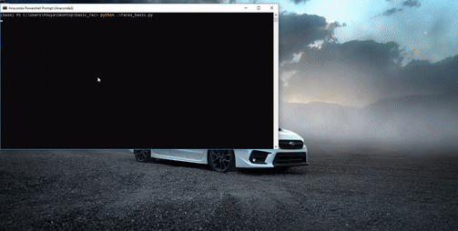

# Edge Detection

Detect edges through your webcam or video input. 
The code can be tweaked for different thersholds to reduce noise and clairy.
I am using OpenCV. 

# Demo

# Libraries Used

cv2 = pip install opencv-python

# Notice 
I am using pre-trained data!! Currently working on a self-training program that recognizes faces and who the person is. 

 Copyright (C) 2000, Intel Corporation, all rights reserved.
 Third party copyrights are property of their respective owners